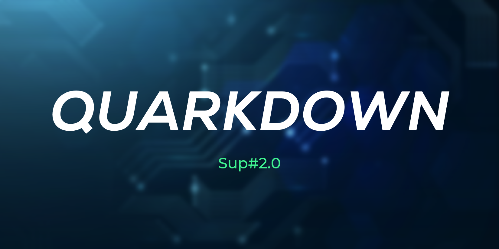

<h1 align="center"> <em> Quarkdown </em> </h1>

A personalised GitHub-Flavoured Markdown to HTML rendering engine, which automatically exports files in GitHub repositories and deploys them to GitHub Pages.

 

## Overview

[Quarkdown](docs/glossary.md) is an engine for extracting Markdown files from a GitHub repo, exporting them to HTML, and adding those files to the repo to be deployed by GitHub Pages.

I like to give my projects their own little bit of jargon for character, so if you’d like to understand the terms used, refer to the [glossary](docs/glossary.md).

> [!TIP]
> For more, see the [docs](docs/).

 

## Features

- A customised Markdown parser which handles Quarkdown-Flavoured Markdown
- An engine for extracting and uploading files through the GitHub API
- Automation through GitHub Actions for automatically exporting and deploying GitHub repositories

 

## Rationale

Over the years I’ve created so, so many Markdown files in *Assort* that it’s basically my own personal wiki at this point. So, I thought why not give people the option to browse it through a website? Don’t get me wrong, GitHub is already fantastic at displaying Markdown files, but with an actual webpage we can make it *so* much more personalised.

 

## Notes

- If the tests are failing, that (probably) means I’m working on some new feature.

 

## Features

### Under Development
- Add special index pages.
- Extract article title into a special `<header>` container.

### Future
- Find a way to combine commits so that a single new deployment doesn’t result in potentially hundreds of programmatically generated commits?
- Check if export filepaths have changed for a file, and if so, delete the artefact file.

 
